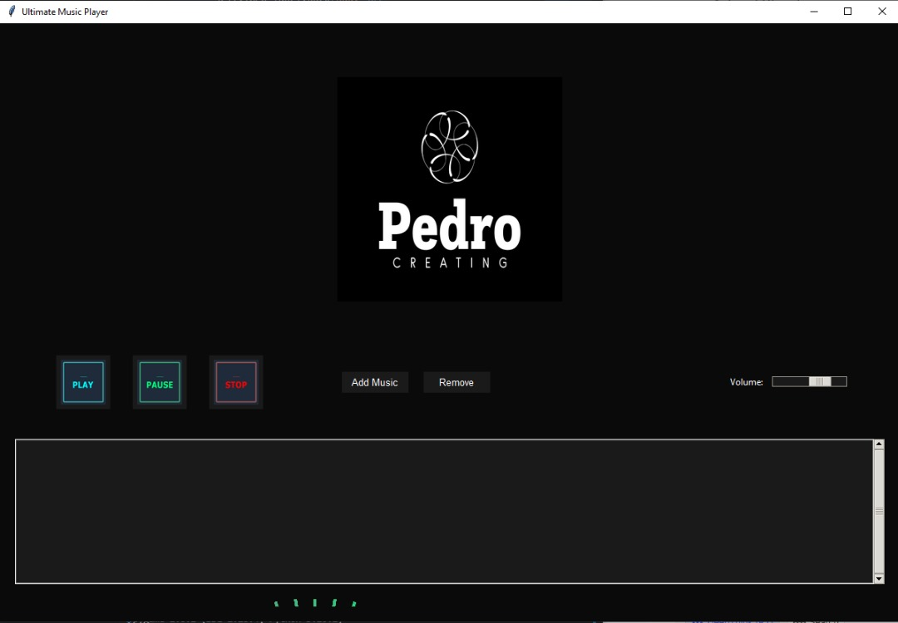

# UltimateMusicPlayer
# 🎵 Ultimate Music Player

[](https://python.org)



A modern desktop music player with stunning visualizations and intuitive controls.

## ✨ Features

- 🎧 Multi-format support (MP3, WAV, FLAC, etc.)
- 🌈 Dynamic spectrum visualizer
- 🎚️ Smooth volume control
- 📁 Playlist management
- ⏯️ Play/Pause/Stop controls
- 🕒 Progress tracking

## 🚀 Installation

```bash
git clone https://github.com/yourusername/UltimateMusicPlayer.git
cd UltimateMusicPlayer
pip install -r requirements.txt

💻 Usage

python MusicPlayer.py

📄 License

MIT License


### 2. Web Deployment Options

Since this is a Python desktop app, here are your best options:

**Option 1: Convert to Web App**
```python
# Add this to convert to web format
from flask import Flask, render_template
app = Flask(__name__)

@app.route('/')
def player():
    return render_template('player.html')

if __name__ == '__main__':
    app.run()
